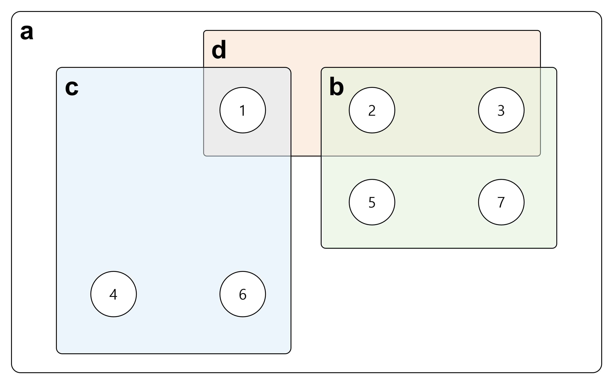

# 1764번 듣보잡([바로가기](https://www.acmicpc.net/problem/1764))

### [처음으로 돌아가기](/README.md)
### [번호별 풀이로 돌아가기](README.md)
### [날짜별 풀이로 돌아가기](/Sort%20by%20date.md)
#
### 문의: yanghs632@gmail.com
### 난이도: Silver 4
### 관련 개념: [#자료구조](https://www.acmicpc.net/problemset?sort=ac_desc&algo=175) [#문자열](https://www.acmicpc.net/problemset?sort=ac_desc&algo=158) [#정렬](https://www.acmicpc.net/problemset?sort=ac_desc&algo=97) [#해시를 사용한 집합과 맵](https://www.acmicpc.net/problemset?sort=ac_desc&algo=136)
### 작성일: 22.01.03
### 수정일

---
## 조건
시간 제한|메모리 제한
:---:|:---:
2초|256 MB

---
## 문제
김진영이 듣도 못한 사람의 명단과, 보도 못한 사람의 명단이 주어질 때, 듣도 보도 못한 사람의 명단을 구하는 프로그램을 작성하시오.

---
## 입력
첫째 줄에 듣도 못한 사람의 수 N, 보도 못한 사람의 수 M이 주어진다. 이어서 둘째 줄부터 N개의 줄에 걸쳐 듣도 못한 사람의 이름과, N+2째 줄부터 보도 못한 사람의 이름이 순서대로 주어진다. 이름은 띄어쓰기 없이 알파벳 소문자로만 이루어지며, 그 길이는 20 이하이다. N, M은 500,000 이하의 자연수이다.

듣도 못한 사람의 명단에는 중복되는 이름이 없으며, 보도 못한 사람의 명단도 마찬가지이다.

---
## 출력
듣보잡의 수와 그 명단을 사전순으로 출력한다.

---
## 예제 입출력 1
입력
```
3 4
ohhenrie
charlie
baesangwook
obama
baesangwook
ohhenrie
clinton
```

출력
```
2
baesangwook
ohhenrie
```

---
## 코드(파이썬)
```python
import sys

n, m = tuple(map(int, sys.stdin.readline().split()))

input_ = sys.stdin.readlines()

no_hear = set(input_[:n])
no_see = set(input_[n:])

result = no_hear.intersection(no_see)

print(len(result))
sys.stdout.write("\n".join(sorted(tuple(map(lambda name: name.strip(), result)))))

```

---
## 특이사항
- python의 set에서 지원하는 집합 연산 중 intersection 사용
- python 집합 연산 정리
  - union                   : 합집합
  - differenct              : 차집합
  - symmetric_difference    : 대칭차
  - isdisjoint              : 교집합이 없는지
  - issuperset              : 확대집합인지
  - issubset                : 부분집합인지
- 예시
  - 
  - ```python
    a = set([1, 2, 3, 4, 5, 6, 7])
    b = set([2, 3, 5, 7])
    c = set([1, 4, 6])
    d = set([1, 2, 3])

    b.union(c)                  # {1, 2, 3, 4, 5, 6, 7}
    a.difference(c)             # {4, 5, 6, 7}
    a.intersection(b)           # {2, 3, 5, 7}
    b.symmetric_difference(d)   # {1, 5, 7}
    a.isdisjoint(b)             # False
    c.isdisjoint(b)             # True
    a.issubset(b)               # False
    b.issubset(a)               # True
    a.issuperset(b)             # True
    b.issuperset(a)             # False
    ```

---
## 참고문헌
\-